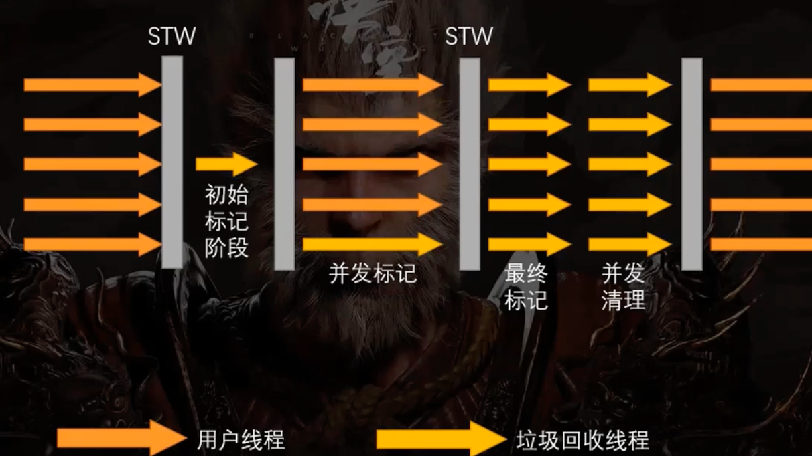

# 垃圾回收

## 如何确定垃圾对象

### 引用计数法
通过引用计数器计算对象的引用次数，有人引用计数器加一，如果引用计数器数值大于1则表示有人在使用这个对象
>存在问题：循环引用导致引用计数器永远大于一
### 可达性分析
从GC root 出发判断哪些对象可以到达，不可达即为垃圾对象
gc root：
- 栈中引用的对象，即局部变量表中的对象
- 类静态属性引用的对象
- 常量引用的对象
- native 本地方法引用的对象

## 垃圾回收算法

### 标记-清除
垃圾收集器标记出垃圾后（实际上为标记出存活对象），将垃圾全部清理
>存在问题：容易产生大量内存碎片，导致内存使用率逐渐降低（分配对象需要使用连续的内存空间，碎片过多的情况会导致，内存可用空间充足，但是依然无法创建对象）

### 标记-复制
将内存分为两块，首先在第一块内存分配对象，垃圾回收时，将第一块内存的存活对象拷贝到另一块内存（连续的），然后将第一块完全清理

>存在问题：虽然避免了出现内存碎片，但是浪费内存空间，始终有块内存是空着的

*JVM堆的分区中，Survivor区就是用作复制算法，Survivor0、Survivor1交替使用*
### 标记-整理
在标记-清除的基础上多了一步碎片整理工作

>存在问题：不适合高频执行，stw时间过长，一般在老年代空间不足会触发一次FullGC，此时会进行标记-整理


## 垃圾收集器

### serial、serial old
单线程的垃圾收集器，serial负责年轻代，serial old 负责老年代
工作模式：
<!-- {:height="100px" width="400px"} -->


> 存在问题：随着内存的增大，stw时间也逐渐增加，十分影响效率

###  parallel Scavenge 、parallel Old
多线程的垃圾收集器，在垃圾回收过程中使用多线程，对于多核cpu或多cpu的服务器来说，大大加快了回收速率


> 存在问题： stop the world 依然无法避免

### CMS收集器、ParNew
支持并发标记，降低了stw的时间


初始阶段仅标记根对象，耗时较短

#### 错标、漏标
    因为是并发标记，标记的同时用户现场也在运行，会不断修改对象引用，会不断产量垃圾，不可避免存在漏标问题
##### 错标的产生
```java
//调用异步方法
obj.close();
obj=null; //此时obj将被标记为垃圾

//一段时间后，如500ms
//close方法中存在
A = this; //将自身的引用传递给了其他对象

//此时CMS回收器并不知晓

//需要进入下一阶段重新标记阶段

```
### G1 垃圾回收器
G1将堆内存划分为若干大小相等的区域（一般默认为2048），Eden区、Survavorqu、老年区不再连续空间的，当一块区域被年轻代对象使用时，它就属于年轻代，当它被清空回收后，又被老年代对象使用时，它就属于老年代。

年轻代和老年代的空间不再绝对固定，方便了扩展，并且当GC扫描内存时不再需要扫描整块内存，仅需扫描特定区域，大大提高所能支持的堆内存大小。

当G1进行垃圾回收，会根据设定的stw时间，对需要扫描的区域进行价值排序（不同的区域垃圾数量不同，回收时间不同），优先满足时间需求，如设定了50ms，则将会在50ms的时间先回收一部分区域，以满足时间要求。

G1在垃圾回收时采用了复制算法，避免了产生碎片。

针对大对象，G1将其单独存放在humongous区域，属于老年代，但是存储独立，在被回收之前位置始终固定不变，避免了GC时频繁移动大对象


> 如果stw时间设置过短，会导致频繁GC，导致吞吐量下降





### 三色标记

- 白色：当前对象未被标记
- 灰色：当前对象被标记过了，但是他的引用未被标记
- 黑色：当前对象被标记过了，而且所有的引用都被标记过了

从GC root出发标记对象，黑色对象不再访问，直接从灰色对象开始访问

**并发标记过程出现对象消失问题如何解决**
[玩转Java面试.05.G1/CMS并发标记原理/三色标记过程/增量更新&SATB](https://www.bilibili.com/video/BV1Uz4y1S798)

> 对象消失问题： 扫描过程中插入了一条或多条从黑色对象到白色对象的新引用，并且同时去掉了灰色对象到该白色对象的直接或者间接引用

1. 增量更新
   当黑色对象新插入白色对象的引用时，记录一下引用关系 如 A->C
   并发扫描结束时，根据记录重新扫描一遍,关注A对象是否新增了对象的引用，并给C进行标记
   典型使用：CMS收集器

2. 原始快照stab 
   当用户线程删除灰色对象对白色对象的引用时，记录一下删除的引用关系如 B->C
   重新扫描时，关注C对象是否被其他对象引用，重新给C进行标记
   [阿里二面：CMS、G1垃圾回收器中的三色标记你了解吗？](https://www.bilibili.com/video/BV1DC4y1u7Tb)


### 跨代引用问题

[玩转Java面试.06.垃圾回收跨代引用/卡表/写屏障](https://www.bilibili.com/video/BV1Jy4y1p7t8)