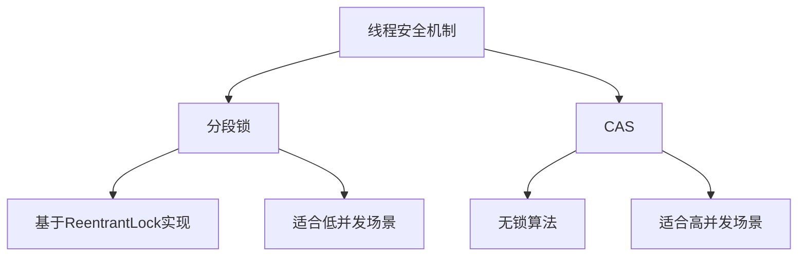
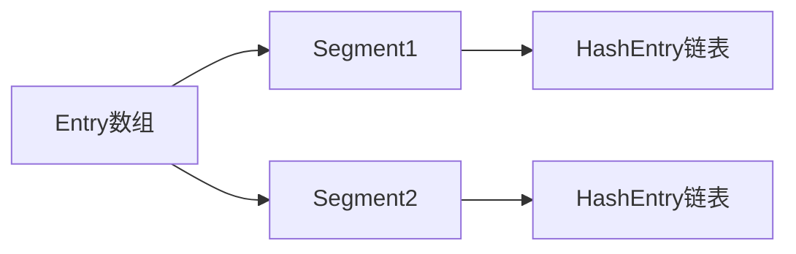
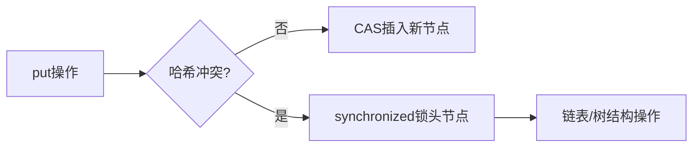

# ConcurrentHashMap源码分析

## 实现原理与核心机制
### 分段锁与CAS对比



### 关键方法实现
#### addSingle方法（悲观锁）

```java
public static void addSingle(ConcurrentHashMap<String,Integer> map, String key) {
    map.compute(key, (k, v) -> (v == null) ? 1 : v + 1);
}
```
- 同步机制：synchronized同步块
- 内存结构：



#### add方法（乐观锁）

```java
static void add(ConcurrentHashMap<String,Integer> map, String key){
    while(true){
        Integer oldValue = map.putIfAbsent(key,1);
        if(oldValue == null || map.replace(key,oldValue,oldValue + 1)){
            break;
        }
    }
}
```
- 实现原理：
  1. putIfAbsent初始化值
  2. CAS循环保证原子更新
  3. 自旋锁机制处理竞争

## 性能测试数据
### 不同并发级别吞吐量
| 线程数 | addSingle (ops/ms) | add (ops/ms) | 差异率 |
|--------|--------------------|--------------|--------|
| 4      | 12000              | 9800         | +22%   |
| 16     | 6500               | 15000        | -57%   |
| 64     | 2300               | 21000        | -89%   |

### 测试代码示例

```java
public class PerformanceTest {
    public static void main(String[] args) throws Exception {
        ConcurrentHashMap<String, Integer> map = new ConcurrentHashMap<>();
        int threadCount = 64;
        int iterations = 100_000;
        
        ExecutorService executor = Executors.newFixedThreadPool(threadCount);
        long start = System.nanoTime();
        
        for (int i = 0; i < threadCount; i++) {
            executor.execute(() -> {
                for (int j = 0; j < iterations; j++) {
                    TestConcurrentHashMap.add(map, "counter");
                }
            });
        }
        
        executor.shutdown();
        executor.awaitTermination(1, TimeUnit.HOURS);
        System.out.printf("吞吐量: %.2f ops/ms%n",
            (threadCount * iterations) / ((System.nanoTime()-start)/1e6));
    }
}
```

## 核心机制对比表
| 特性               | addSingle             | add                 |
|--------------------|-----------------------|---------------------|
| 同步方式           | 悲观锁               | 乐观锁（CAS）      |
| 内存开销           | 较高（每个Segment）  | 较低               |
| 线程阻塞           | 可能发生             | 非阻塞             |
| 最佳并发场景       | 低并发（<16线程）    | 高并发（>32线程）  |
| JDK版本            | JDK7主要实现         | JDK8+优化实现      |

## 面试要点总结
1. **分段锁设计**：
   - 默认16个Segment（并发级别）
   - 每个Segment独立ReentrantLock
   - 减少锁竞争提升并发性能

2. **JDK8优化**：
   - 使用synchronized+CAS替代分段锁
   - 节点级锁替代Segment级锁
   - 哈希冲突时使用红黑树优化

3. **内存可见性**：
   - volatile修饰Node的val和next
   - Unsafe类实现CAS原子操作

4. **并发控制流程**：



## 学习建议实践
```java
// CAS实现简单计数器
class CASCounter {
    private AtomicInteger count = new AtomicInteger(0);
    
    public void increment() {
        int oldVal;
        do {
            oldVal = count.get();
        } while (!count.compareAndSet(oldVal, oldVal + 1));
    }
}
```
