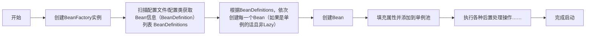

# 手写简易的IOC容器
本节内容为手写一个简易IOC容器
要求实现基于xml文件配置和基于配置类注解配置的ioc容器

## 启动流程示意图




## 项目模块设定


```
src/
├── main/
│   └── java/
│       └── site/
│           └── xzq_xu/
│               ├── aop/                  # AOP 核心接口和实现
│               │   ├── AdvisedSupport.java
│               │   ├── Advisor.java
│               │   ├── Pointcut.java
│               │   └── framework/        # AOP 框架实现
│               │       ├── ProxyFactory.java
│               │       └── JdkDynamicAopProxy.java
│               ├── beans/                # Bean 定义和生命周期管理
│               │   ├── BeanDefinition.java
│               │   ├── BeanFactory.java
│               │   └── factory/          # Bean 工厂实现
│               │       ├── ConfigurableListableBeanFactory.java
│               │       └── support/
│               │           ├── DefaultListableBeanFactory.java
│               │           └── AbstractBeanFactory.java
│               ├── context/              # 应用上下文和事件机制
│               │   ├── ApplicationContext.java
│               │   ├── event/            # 事件监听器实现
│               │   │   ├── ContextClosedEvent.java
│               │   │   └── ContextRefreshedEvent.java
│               │   └── support/          # 上下文支持类
│               │       ├── ClassPathXmlApplicationContext.java
│               │       └── AbstractApplicationContext.java
│               ├── core/                 # 核心工具类和类型转换
│               │   ├── convert/          # 类型转换服务
│               │   │   ├── ConversionService.java
│               │   │   └── support/
│               │   │       └── DefaultConversionService.java
│               │   └── io/               # 资源加载器
│               │       ├── Resource.java
│               │       └── ResourceLoader.java
│               └── stereotype/           # 注解类
│                   └── Component.java
└── test/
    └── java/
        └── site/
            └── xzq_xu/
                └── test/
                    ├── aop/              # AOP 测试类
                    │   ├── AutoProxyTest.java
                    │   └── DynamicProxyTest.java
                    ├── bean/             # 测试用 Bean 类
                    │   ├── A.java
                    │   └── Car.java
                    ├── common/           # 通用工具类
                    │   ├── CarFactoryBean.java
                    │   └── CustomerBeanPostProcessor.java
                    ├── ioc/              # IoC 容器测试类
                    │   ├── ApplicationContextTest.java
                    │   └── BeanDefinitionAndBeanDefinitionRegistryTest.java
                    └── service/          # 服务类实现和测试
                        ├── HelloService.java
                        └── WorldService.java
```

模块功能概述：
- aop: 提供面向切面编程的支持，包括代理创建、方法拦截等功能。
- beans: 实现 Bean 的定义、属性注入、生命周期管理等核心功能。
- context: 提供应用上下文的支持，包括事件机制、配置文件解析等。
- core: 提供核心工具类和类型转换服务。
- stereotype: 提供注解类，用于标记 Spring 组件。
- test: 包含单元测试和集成测试，覆盖 AOP、IoC、事件机制等功能。


**使用lombok简化代码**