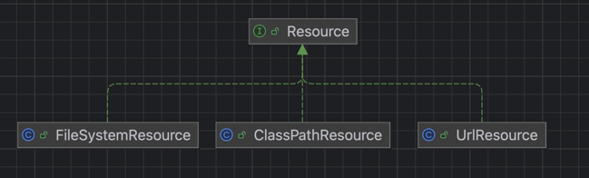
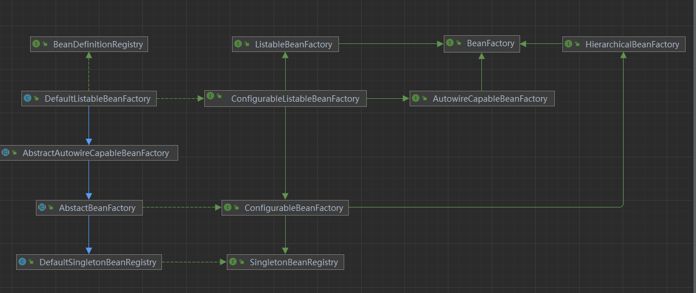
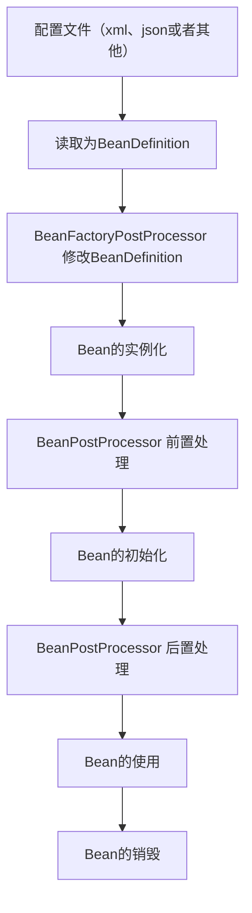
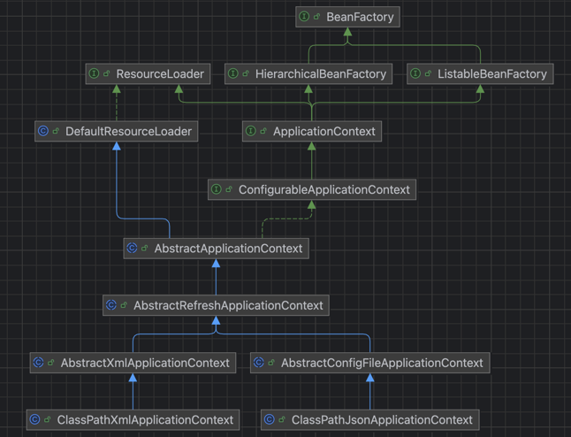

# 手写一个Spring容器


## 最简单的Bean容器
定义一个简单的bean容器BeanFactory，内部包含一个map用以保存bean，只有注册bean和获取bean两个方法
> 分支名： simple-bean-factory
```java
//容器
public class BeanFactory {
	private Map<String, Object> beanMap = new HashMap<>();

	public void registerBean(String name, Object bean) {
		beanMap.put(name, bean);
	}

	public Object getBean(String name) {
		return beanMap.get(name);
	}
}
```
[测试代码](./src/test/java/site/xzq_xu/beans/factory/BeanFactoryTest.java)


## BeanDefinition和BeanDefinitionRegistry

> 分支名： bean-definition-and-bean-definition-register（创建时打错字了） 

主要增加这些类：
- BeanDefinition：bean的定义信息，包含bean的class信息，构造参数、属性值等信息，每个bean对应一个BeanDefinition的实例（单例bean）。简化版本仅包含class信息
- BeanDefinitionRegistry：注册beanDefinition的接口，定义注册BeanDefinition的方法
- SingletonBeanRegistry：定义了添加和获取单例Bean的方法
- DefaultSingletonBeanRegistry：SingletonBeanRegistry的实现类

Bean容器实现BeanDefinitionRegistry和SingletonBeanRegistry接口，向Bean容器重注册BeanDefinition之后，使用Bean时才会实例化


[测试代码](./src/test/java/site/xzq_xu/test/ioc/BeanDefinitionAndBeanDefinitionRegistryTest.java)


## Bean实例化策略InstantiationStrategy

> 分支名: instantiation-strategy

目前的Bean创建是通过 AbstractAutowireCapableBeanFactory.doCreateBean的方法，
其中主要使用了 ` beanClass.getDeclaredConstructor().newInstance();`调用了无参构造器实例化Bean，
仅使用于Bean存在无参构造器的情形。
所以，针对实例化Bean的方式，抽象出一个实例化策略接口InstantiationStrategy，给出三个实现类：
- SimpleInstantiationStrategy，使用bean的构造方法来实例化
- CglibSubclassingInstantiationStrategy，使用CGLIB动态生成子类 ,在JDK9及以后的JDK中需要添加JVM参数 --add-opens java.base/java.lang=ALL-UNNAMED ，否则运行会报错
- ByteBuddySubClassingInstantiationStrategy，使用ByteBuddy动态生成子类，主要解决使用JDK9引入模块化系统以后，不允许外部模块方法反射访问


[测试代码](./src/test/java/site/xzq_xu/test/ioc/InstantiationStrategyTest.java)


## Bean的属性填充

> 分支名： populate-bean-with-property-values

目前Definition中只有Bean的class信息，这里增加Bean的属性信息，在实例化Bean之后为Bean填充属性
- PropertyValue：保存Bean的属性信息
- PropertyValues: 保存Bean的多个属性信息
- AbstractAutowireCapableBeanFactory.applyPropertyValues：填充Bean的属性

#### 思考：为什么采用PropertyValues，而不是直接使用List<PropertyValue>


[测试代码](./src/test/java/site/xzq_xu/test/ioc/PopulateBeanWithPropertyValuesTest.java)


## Bean的依赖注入，（高级版属性填充，为bean的属性填充bean）

> 分支名： inject-bean-with-dependencies

在上一部分实现了实例化Bean时对Bean的一般属性进行填充，这一部分需要实现填充Bean的属性值为另一个bean的情况
这里引入一个BeanReference，
包装对于另一个Bean的引用，实例化beanA后填充属性时，
若PropertyValue#value为BeanReference，引用beanB，则先去实例化beanB。
为了降低代码复杂度，这里不考虑循环依赖的情况
```java

 protected void applyPropertyValues(String beanName, Object bean,BeanDefinition beanDefinition) {
    try {
        //遍历beanDefinition中的属性值
        for (PropertyValue propertyValue : beanDefinition.getPropertyValues().getPropertyValues()) {
            String name = propertyValue.getName();
            Object value = propertyValue.getValue();
            if (value instanceof BeanReference beanReference) {
                //如果属性值为BeanReference，则先去实例化BeanReference所引用的Bean
                value = getBean(beanReference.getBeanName());
            }
            //通过反射设置属性值
            BeanUtil.setProperty(bean, name, value);
        }
    } catch (Exception e) {
        //抛出异常
        throw new BeansException("属性填充失败,Bean:"+beanName, e);
    }
}

```


[测试代码](./src/test/java/site/xzq_xu/test/ioc/InjectBeanWithDependenciesTest.java)


## 资源和资源加载器

> 分支名： resource-and-resource-loader 

此前对于bean的加载，都是通过硬编码的方式，这里引入资源类Resource，资源加载器ResourceLoader，为后续从配置文件加载Bean提供基础

- Resource：资源接口，定义了获取资源文件的方式
  - ClassPathResource：从类路径下加载资源
  - FileSystemResource：从文件系统加载资源
  - UrlResource：从URL加载资源
- ResourceLoader：资源加载器接口，定义了加载资源的方法
  - DefaultResourceLoader：资源加载器的默认实现，根据资源路径的前缀选择不同的资源加载方式




[测试代码](./src/test/java/site/xzq_xu/test/ioc/ResourceAndResourceLoaderTest.java)


## 在文件中定义BeanDefinition（以xml和Json为例，也可以在实现其他类型）

> 分支名： define-bean-definition-in-file

在这之前有了资源的描述和资源加载器，就可以在配置文件中声明式的定义BeanDefinition或者说Bean的信息，资源加载器读取配置文件（json、xml），
解析bean的信息，然后向容器中注册BeanDefinition

定义一个BeanDefinitionReader接口，用来读取Bean的定义信息
BeanDefinitionReader的实现类需要有获取资源的能力，且读取完bean的定义信息后需要将其（BeanDefinition）注册到容器所以定义一个抽象实现类
AbstractBeanDefinitionReader，实现BeanDefinitionReader接口，拥有两个属性 ResourceLoader和 BeanDefinitionRegister，分别用来加载资源，注册BeanDefinition

实现两个实现类：
- XmlBeanDefinitionReader：读取xml文件，解析bean的定义信息，注册到容器
- JsonBeanDefinitionReader：读取json文件，解析bean的定义信息，注册到容器

因为读取文件获取都是String类型，所以这里先只是实现String类型的属性和Reference属性，后续可以扩展为其他类型

同时调整一下BeanFactory的层级，以尽可能和Spring中的BeanFactory保持一致





[测试代码](src/test/java/site/xzq_xu/test/ioc/FIleBeanDefinitionTest.java)


## BeanFactoryPostProcessor 和 BeanPostProcessor

> 分支名： bean-factory-post-processor-and-bean-post-processor

- BeanFactoryPostProcessor和BeanPostProcessor是spring框架中具有重量级地位的两个接口，理解了这两个接口的作用，基本就理解spring的核心原理了。
- BeanFactoryPostProcessor：BeanFactory的后置处理器，在BeanFactory初始化完成后，Bean实例化之前，可以对BeanFactory进行修改，比如修改BeanDefinition的属性
- BeanPostProcessor：Bean的后置处理器，在Bean实例化之后，初始化之前，可以对Bean进行修改，比如修改Bean的属性；

BeanFactoryPostProcessor和BeanPostProcessor的区别在于，BeanFactoryPostProcessor是在BeanFactory初始化完成后，Bean实例化之前，对BeanFactory进行修改， BeanPostProcessor是在Bean实例化之后，初始化之前，对Bean进行修改。
BeanPostProcessor也是后面实现AOP的关键，BeanPostProcessor的两个方法分别在bean执行初始化方法（后面实现）之前和之后执行


[测试代码](src/test/java/site/xzq_xu/test/ioc/BeanFactoryPostProcessorAndBeanPostProcessorTest.java)


## 应用程序上下文 applicationContext

> 分支名：application-context

应用程序上下文`ApplicationContext`是Spring中之于`BeanFactory`更加先进的IOC容器，它出了支持`BeanFactory`的所有功能之外，
还支持特殊类型bean如`BeanFactoryPostProcessor`和`BeanPostProcessor`的
自动识别、资源加载、容器事件和监听器、国际化支持、单例bean自动初始化等。

`BeanFactory`是Spring的基础设施，面向Spring本身；
`ApplicationContext`是面向使用Spring的开发者，几乎所有的应用场合都可以直接使用`ApplicationContext`而不是底层的`BeanFactory`。


bean目前的生命周期


ApplicationContext层次图



[测试代码](src/test/java/site/xzq_xu/test/ioc/ApplicationContextTest.java)


