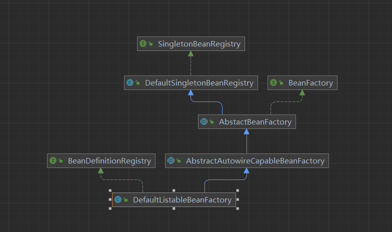
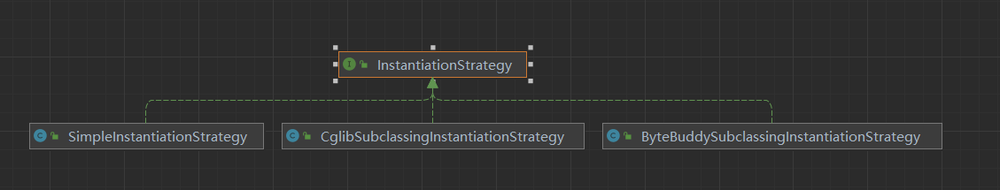
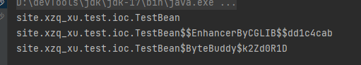

# 手写一个Spring容器


## 最简单的Bean容器
定义一个简单的bean容器BeanFactory，内部包含一个map用以保存bean，只有注册bean和获取bean两个方法
> 分支名： simple-bean-factory
```java
//容器
public class BeanFactory {
	private Map<String, Object> beanMap = new HashMap<>();

	public void registerBean(String name, Object bean) {
		beanMap.put(name, bean);
	}

	public Object getBean(String name) {
		return beanMap.get(name);
	}
}
```
[测试代码](./src/test/java/site/xzq_xu/beans/factory/BeanFactoryTest.java)


## BeanDefinition和BeanDefinitionRegistry

> 分支名： bean-definition-and-bean-definition-register（创建时打错字了） 

主要增加这些类：
- BeanDefinition：bean的定义信息，包含bean的class信息，构造参数、属性值等信息，每个bean对应一个BeanDefinition的实例（单例bean）。简化版本仅包含class信息
- BeanDefinitionRegistry：注册beanDefinition的接口，定义注册BeanDefinition的方法
- SingletonBeanRegistry：定义了添加和获取单例Bean的方法
- DefaultSingletonBeanRegistry：SingletonBeanRegistry的实现类

Bean容器实现BeanDefinitionRegistry和SingletonBeanRegistry接口，向Bean容器重注册BeanDefinition之后，使用Bean时才会实例化


[测试代码](./src/test/java/site/xzq_xu/test/ioc/BeanDefinitionAndBeanDefinitionRegistryTest.java)


## Bean实例化策略InstantiationStrategy

> 分支名: instantiation-strategy

目前的Bean创建是通过 AbstractAutowireCapableBeanFactory.doCreateBean的方法，
其中主要使用了 ` beanClass.getDeclaredConstructor().newInstance();`调用了无参构造器实例化Bean，
仅使用于Bean存在无参构造器的情形。
所以，针对实例化Bean的方式，抽象出一个实例化策略接口InstantiationStrategy，给出三个实现类：
- SimpleInstantiationStrategy，使用bean的构造方法来实例化
- CglibSubclassingInstantiationStrategy，使用CGLIB动态生成子类 ,在JDK9及以后的JDK中需要添加JVM参数 --add-opens java.base/java.lang=ALL-UNNAMED ，否则运行会报错
- ByteBuddySubClassingInstantiationStrategy，使用ByteBuddy动态生成子类，主要解决使用JDK9引入模块化系统以后，不允许外部模块方法反射访问





[测试代码](./src/test/java/site/xzq_xu/test/ioc/InstantiationStrategyTest.java)



## Bean的属性填充

> 分支名： populate-bean-with-property-values

目前Definition中只有Bean的class信息，这里增加Bean的属性信息，在实例化Bean之后为Bean填充属性
- PropertyValue：保存Bean的属性信息
- PropertyValues: 保存Bean的多个属性信息
- AbstractAutowireCapableBeanFactory.applyPropertyValues：填充Bean的属性

#### 思考：为什么采用PropertyValues，而不是直接使用List<PropertyValue>


[测试代码](./src/test/java/site/xzq_xu/test/ioc/PopulateBeanWithPropertyValuesTest.java)


