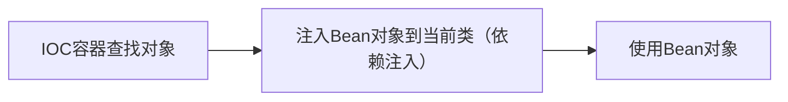
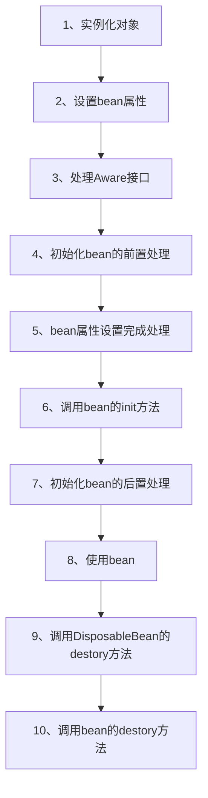
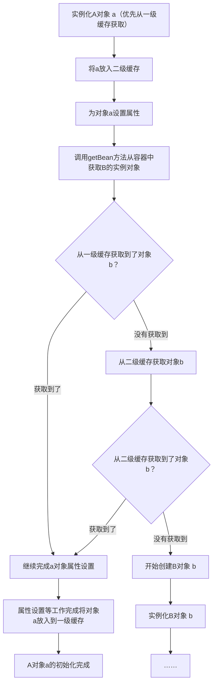

# spring IOC容器

> spring 框架最经典的两大特性就是IOC（控制反转）和面向切面（AOP）

## IOC 容器

IoC是Spring框架的核心概念，它将对象的创建、组装和管理的控制权从应用程序代码中反转到Spring的IoC容器中，由IoC容器的ApplicationContext，实现对象的自动装配和依额注入。简而言之，IOC思想就是创建对象的控制权，被反转到了Spring框架上。

### Bean的装配流程
某个类中，添加了@Compoent注解以后，项目在启动时，会执行Bean装配流程，如图
  ```mermaid
  graph LR
    A[项目启动] --> B[加载配置文件]
    --> C[根据配置生成Bean对象]
    --> D[将Bean对象添加到对象池]
    --> F[装配完成]
  ```


对于类中的属性，在添加了@Autowired 注解（或者其他方式：构造器、Resouce）以后，会执行Bean加载（依赖注入）流程，如图



IOC容器装配Bean的详细流程：
1. 创建`BeanFactory`实例，并加载配置文件
2. 根据配置文件Bean信息，创建`BeanDefination` 对象
3. 将`BeanDefination`对象注册到 `BeanFactory`
4. 根据  `BeanDefination` 信息，进行`Bean`的实例化（处理构造参数的依赖注入），得到空的 `Bean` 示例
5. 填充 `Bean`属性，处理`@Autowired` 、 `@Value` 等注释， 完成依赖注入
6. `Bean` 的初始化 （`Bean` 最后一步处理， 如调用自定义 `init-method()` 方法），得到一个可用的 `Bean`实例
7. 检查 `Bean`之间的依赖关系，确保依赖关系已满足
8. 将完全初始化的 `Bean` 添加到单例池
9. 完成加载，开始使用容器提供的 `Bean` (`@Autowired` 自动注入 `Bean`， `@Qualifer` 指定具体的`Bean`，`ApplicationContext` 获取 指定的 `Bean`) 

这里1、2步骤加载对应配置文件； 3、4、5、6、7步骤对应根据配置文件生成Bean对象； 8步对应将Bean对象加入到依赖池；9步骤对应完成装配

### IOC容器原理
IOC容器的原理可以理解为以下几个方面

- 封装对象创建和生命周期管理
- 依赖注入（DI）
- 反射（Reflection）
- 配置元数据
- 容器内部结构
- 作用域管理

#### 封装对象创建和生命周期管理
在传统的程序设计中，对象的创建、配置和销毁通常由开发者手动管理，而在IOC容器，这些工作都有IOC容器接管。开发者不再需要关系对象的生命周期，只需要通过配置文件或者注解的方式声明对象的创建方式、依赖关系以及生命周期行为，Spring框架的IOC容器会自动创建、配置和销毁对象。

``` java
//注解定义Bean
@Componet
public class MyService{
  public void doSomething(){
     // ………
  }
}
```
```XML
<!-- 配置文件定义Bean-->
<bean id="myService"  class="com.x.x.MyService"/>
```

``` java
//依赖注入，Spring中被依赖注入的Bean也需要被Spring管理，或者说只有这样才叫做依赖注入
@Componet
public class DemoA{
  @Autowired
  // @Qualifer("myService")  使用这个注入指定的Bean
  private MyService myService;

  public void AnotherMethod(){
    //……
  }
}
```

以上例子中，分别使用了注解方式和配置文件方式声明了类`MyService`的实例对象（创建方式、依赖关系、生命周期，没有配置采用了默认配置） ，开发不在需要手动去创建、配置和销毁`MyService`的实例对象。 其他对象（被容器管理）中需要使用该实例对象时，只需要依赖注入即可。


#### 依赖注入

依赖注入是IOC容器实现控制反转的一种方式，容器负责将对象所需要的外部资源（称之为依赖）注入到对象内部，而不是对象自己去手动创建或者查找。

下面的例子里，通过构造器注入，Spring容器会在自动将`MyService`所需要的`MyDependency`实例对象注入到对象内部，而不需要在`MyService`内部自己去创建`MyDependency`对象。以上过程中，MyService依赖于MyDependcy，容器自动将`MyDependency`注入到`MyService`中，称为**依赖注入**; 当前对象所需要的依赖是由IOC容器注入的，而非对象本身创建或者查找的，这是实现效果称为控制反转。

```java
//构造器注入
@Componet
public class MyService{
  private final MyDependency myDependency;

  public MyService(MyDependency myDependency){
    this.myDependency = myDependency;
  }

  public void doSomething(){
    myDependency.do();
  }

}

@Compenet
public class MyDependency{
  public void do(){
    //…… 
  }
}

```

#### 反射
Spring IOC容器大量使用JAVA的反射机制来创建和操作对象。
通过反射，容器可以在运行时动态的创建对象实例、访问私有字段和方法，从而实现对对象的管理和依赖注入。

```java
//通过反射调用生成的Bean
// @Service
public class MyServiceImpl implements MyServiceInterface{
  @Override
  public void execute(){
    //……
  }
}

@Configuration
public class AppConfig{
  @Bean
  public MyServiceInterface myService(){
    return new MyServiceImpl();
  }
}

```

在上面这个例子中`AppConfig`中的`myService`方法将被Spring容器通过反射调用，以创建`MyServiceInterface`的实现

#### 配置元数据
对象的配置信息可以通过XML文件、注解或者Java配置类等形式提供。
这些配置元数据包含了对象的创建、属性设置、依赖关系和其他生命周期相关的信息。
Spring框架在启动时，IOC容器会读取这些配置元数据，并根据这些信息创建和管理对象。


```XML
<!-- 使用配置文件定义依赖关系 -->
<!-- applicationCopntext.xml -->
<bean id="myService" class="com.x.x.MyService"> 
  <property name="myDependency"  ref="myDependency">
</bean>

<bean id="myDependency" class="com.x.x.myDependency"> 

```

```java
//使用注解定义依赖关系
@Componet
public class MyService{
  @Autowired
  private  MyDependency myDependency;

}

@Compenet
public class MyDependency{
  public void do(){
    //…… 
  }
}
```

这里，分别使用了XML配置文件和注解的方式配置元数据，定义了MyService和MyDependency的依赖关系


#### 容器的内部结构
Spring IOC容器的内部维护了一个Bean工厂（`BeanFactory`），负责创建和管理Bean的实例。
IOC容器会根据配置信息创建bean的定义信息（`BeanDefinition`）和实例化`bean`，为保证每个`bean`都能获取它所需要的其他`bean`（依赖），IOC容器还负责维护bean之间的依赖关系。

```java
public class MyBean{
  public MyBean(){
    // 构造器逻辑
  }
  public void init(){
    // 初始化逻辑
  }

  public void destory(){
    // 销毁逻辑
  }

}
//配置文件定义
<bean id="myBean" class="xx.xx.MyBean" init-method="init" destroy-method="destory" />
```
spring 容器会调用构造器来创建实例，并在适当的时候init和destroy方法。

#### 作用域管理
SpringIOC容器支持多种作用域，如单例（singleton）、原型（prototype）、会话（session）和请求（request）

```java
//Bean 的作用域管理
@Componet
public class SingletonBean{
  //这个对象是单例的
}

@Componet
public class PrototypeBean{
  //这个对象的作用域是prototype，每次注入都会创建一个新的实例
}
```
SingletonBean作为单例存在，而PrototypeBean 每次注入都会创建一个新的实例


SpringIOC容器通过封装对象的创建和生命周期管理，使用依赖注入来解耦对象之间的依赖关系，利用反射和配置元数据来动态创建和管理对象，同时提供了作用域管理功能。


### Bean的生命周期

1. 调用构造方法实例化Bean对象 
2. 设置Bean属性（调用Bean的set方法） 
3. 如果Bean实现各种Aware接口，则会注入Bean对容器基础设施层面的依赖。Aware接口具体包括BeanNameAware、BeanFactoryAware、ApplicationContextAware,分别注入Bean ID、Bean Factory或者ApplicationContext 
4. 如果定义了一个类实现了BeanPostProcessor，调用重写BeanPostProcessor的前置初始化方法postProcessBeforeInitialization 
5. 如果Bean实现InitializingBean接口，则会调用afterPropertiesSet方法 
6. 调用Bean自身的init方法（配置init-method） 
7. 如果定义了一个类实现了BeanPostProcessor，调用重写BeanPostProcessor的后置方法postProcessAfterInitialization 
8. 使用Bean 
9. 如果Bean实现DisposableBean，则会调用destroy方法 
10. 调用Bean自身的destroy方法（配置destroy-method）




### 如何解决Bean的循环依赖问题

总体思路是通过缓存的方式解决循环依赖问题
**当然最好的方式还是不要在代码中出现循环引用**

> 调试代码@day5/springIoc/src/main/java/site/leftx/Main.java


#### 简单示意循环依赖问题

现假设class A依赖class B，循环依赖问题解决示意图如下
设A先实例化，忽略非关键步骤
> 解决有代理的对象的循环依赖问题，需要提前暴露代理对象的引用而非代理对象的引用。


#### 容器启动到依赖注入源码调试过程

```mermaid
 graph TD
    A[容器启动调用refresh方法] --> B[完成准备工作后调用 finishBeanFactoryInitialization 方法，执行bean的创建]
    --> C[完成bean创建前的准备工作后 执行beanFactory 的 preInstantiateSingletons 方法实例化所有singleton的Bean（遍历依次创建）]
    --> D{判断Bean是否为FactoryBean} --是--> D1[执行FactoryBean的创建流程，一般只在调用getObject方法进行bean的创建]
    D --不是--> Z[调用getBean【doGetBean】方法获取 bean对象]
    D1 --isEagerInit设置为true--> Z
    Z --> E[getBean中判断是singleton之后执行了getSingleton方法]
    --getSingleton方法中执行会执行createBean【doCreateBean】方法--> F[createBean方法中首先创建了空的实例对象然后调用populateBean方法完成属性填充（执行方法：applyPropertyValues）]
    --> Y[在调用populateBean方法之前，因为当前处于singletonBean的创建状态中所以会将 “（） -> getEarlyBeanReference” <br>这一 singletonFactory 加入到 singletonFactories缓存（即三级缓存）中，同时会确保一级和二级缓存中没有该bean]
    --> G[populateBean方法填充定义自Definition（即配置）中的属性，其中调用BeanDefinitionValueResolver的resolveValueIfNecessary方法处理对容器中其他对象的引用]
    --> H[调用resolveReference方法处理对其他Bean的依赖]
    --> I[调用beanFactory的getBean方法获取属性值 依赖对象b（原对象称为a）]
    --> J[再次来到getSingleton方法处，执行了createBean【doCreateBean】方法]
    --> K[因为是依赖对象b也是也是在创建中所以依然会将 “（） -> getEarlyBeanReference” <br>这一 singletonFactory 加入到 singletonFactories缓存（即三级缓存）中，同时会确保一级和二级缓存中没有该bean]
    --> L[继续执行对象b的属性填充populateBean]
    --> M[再次来到valueResolver.resolveValueIfNecessary填充所有在容器的属性，需填充对象a]
    --> N[再一次使用beanFactory的getBean获取属性值，这次获取的是【对象b的依赖】 对象a]
    --> O[此次在doGetBean中调用单参数的getSingleton方法 （前两次也会调用但是获取不到值，所以省略了）]
    --> P{单参数getSingleton方法先尝试从singletonObjects、earlySingletonObjects中获取对象a}
    P --获取到了--> P1[直接返回对象a（但此时显然获取不到）] 
    P --一级二级缓存都没获取到--> Q[从singletonFactories（三级缓存）中获取 “（） -> getEarlyBeanReference” singletonFactory]
    Q --> Q1[执行singletonFactory的getObject方法即getEarlyBeanReference方法，获取到一个空的对象a，将其放入earlySingletonObjects，
    并移出singletonFactories，返回对象a]
    P1 --> R[完成对象b对对象a的依赖引用，完成对象b的创建，执行对象b的一些初始化操作（处理aware、调用init、***加入单例池***等,回到对象的属性填充步骤,此时单例池即一级缓存中已经有了对象b]
    Q1 --> R 
    R --> S[对象a的属性填充完成后调用initializeBean方法：完成初始化操作，完成对象a的创建]
    --> T[因为是依次创建所有singleton对象，对象a创建结束，开始创建对象b，getBean从单例池中获取到了对象b，创建结束]

```





