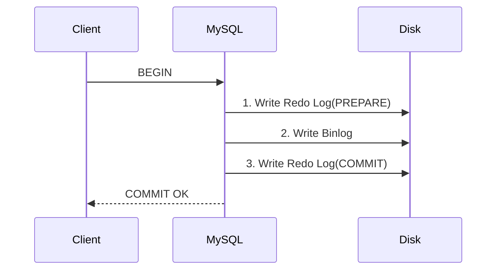

# MySQL面试核心知识点

## 一、基础概念

### 1.1 事务隔离级别
#### 1.1.1 四种隔离级别
1. READ UNCOMMITTED (读未提交)
   - 问题：脏读、不可重复读、幻读
2. READ COMMITTED (读已提交)
   - 解决脏读
3. REPEATABLE READ (可重复读，MySQL默认)
   - 解决脏读、不可重复读
4. SERIALIZABLE (串行化)
   - 解决所有问题但性能最低

#### 1.1.2 解决方案
- MVCC机制：通过版本链实现非阻塞读
- Next-Key Locks：解决幻读问题

### 1.2 CRUD基础语法
```sql
-- 插入
INSERT INTO table (col1, col2) VALUES (val1, val2);

-- 查询 
SELECT * FROM table WHERE condition;

-- 更新
UPDATE table SET col = val WHERE condition;

-- 删除
DELETE FROM table WHERE condition;
```

### 1.3 ACID特性
| 特性   | 实现机制                | 说明                      |
|--------|-------------------------|---------------------------|
| 原子性 | Undo Log                | 事务回滚保证操作原子性    |
| 一致性 | 约束检查+日志           | 数据库状态始终合法        |
| 隔离性 | 锁+MVCC                 | 并发事务互不干扰          |
| 持久性 | Redo Log                | 事务提交后数据持久化      |

### 1.4 存储引擎对比
| 特性         | InnoDB             | MyISAM       |
|--------------|--------------------|--------------|
| 事务支持     | ✅                  | ❌            |
| 行级锁       | ✅                  | ❌            |
| 外键         | ✅                  | ❌            |
| 崩溃恢复     | ✅                  | ❌            |
| 存储结构     | 聚簇索引           | 堆表         |
| 适用场景     | 高并发写/事务      | 读多写少     |

### 1.5 连接类型
1. 内连接（INNER JOIN）
   ```sql
   SELECT * FROM A INNER JOIN B ON A.id = B.aid;
   ```
2. 外连接
   - LEFT JOIN: 保留左表全部记录
   - RIGHT JOIN: 保留右表全部记录
   - FULL JOIN: 保留两表全部记录（MySQL不支持）

---

## 二、高级特性

### 2.1 MVCC实现
#### 2.1.1 核心组件
- 隐藏字段：DB_TRX_ID（事务ID）、DB_ROLL_PTR（回滚指针）
- Undo Log：维护数据历史版本
- Read View：可见性判断规则

#### 2.1.2 读类型
- 快照读：普通SELECT（基于Read View）
- 当前读：SELECT FOR UPDATE/INSERT/UPDATE/DELETE

### 2.2 索引优化
#### 2.2.1 B+树优势
- 非叶子节点仅存储键值
- 叶子节点形成有序链表
- 3层结构可存储2000万+数据

#### 2.2.2 索引失效场景
1. 违反最左前缀原则
2. 对列进行函数操作
3. 隐式类型转换
4. LIKE以%开头
5. OR条件包含非索引列

### 2.3 日志系统
#### 2.3.1 日志类型对比
| 日志类型 | 作用                  | 写入时机            |
|----------|-----------------------|---------------------|
| Redo     | 崩溃恢复              | 事务进行中持续写入  |
| Binlog   | 主从复制/数据归档     | 事务提交时批量写入  |
| Undo     | 事务回滚/MVCC         | 数据修改前记录      |

#### 2.3.2 两阶段提交流程


---

## 三、实战场景

### 3.1 MyBatis批量插入
```xml
<insert id="batchInsert">
    INSERT INTO users(name,age) VALUES
    <foreach item="item" collection="list" separator=",">
        (#{item.name},#{item.age})
    </foreach>
</insert>
```
配置建议：
```properties
rewriteBatchedStatements=true
```

### 3.2 SQL优化策略
#### 3.2.1 索引优化
- 覆盖索引：SELECT需要的列都包含在索引中
- 索引下推：WHERE条件在存储引擎层过滤

#### 3.2.2 查询优化
- 分页优化：
  ```sql
  -- 传统分页
  SELECT * FROM table LIMIT 10000,10;
  
  -- 优化分页
  SELECT * FROM table WHERE id > 10000 LIMIT 10;
  ```

#### 3.2.3 结构设计
- 控制单表数据量在500万以下
- 使用TINYINT代替ENUM类型
- 避免TEXT/BLOB大字段

### 3.3 锁机制
#### 3.3.1 锁类型
| 锁类型   | 粒度  | 冲突               |
|----------|-------|--------------------|
| 共享锁(S)| 行级  | 与排他锁冲突       |
| 排他锁(X)| 行级  | 与所有锁冲突       |
| 意向锁   | 表级  | 快速判断表级冲突   |

#### 3.3.2 死锁处理
- 设置锁超时：innodb_lock_wait_timeout
- 死锁检测：innodb_deadlock_detect

---

## 四、监控调优

### 4.1 Explain关键指标
| 字段    | 说明                          | 优化建议              |
|---------|-------------------------------|-----------------------|
| type    | 访问类型（至少达到range）     | 添加合适索引          |
| key     | 实际使用索引                  | 确保使用最优索引      |
| rows    | 预估扫描行数                  | 减少扫描范围          |
| Extra   | 附加信息                      | 避免Using filesort    |

### 4.2 慢查询优化
1. 开启慢查询日志
   ```sql
   SET GLOBAL slow_query_log = ON;
   SET GLOBAL long_query_time = 2;
   ```
2. 分析工具：
   - mysqldumpslow
   - pt-query-digest

### 4.3 连接池配置
推荐配置：
```ini
# 最大连接数
maxActive=20
# 最小空闲连接
minIdle=5
# 最大等待时间(ms)
maxWait=30000
