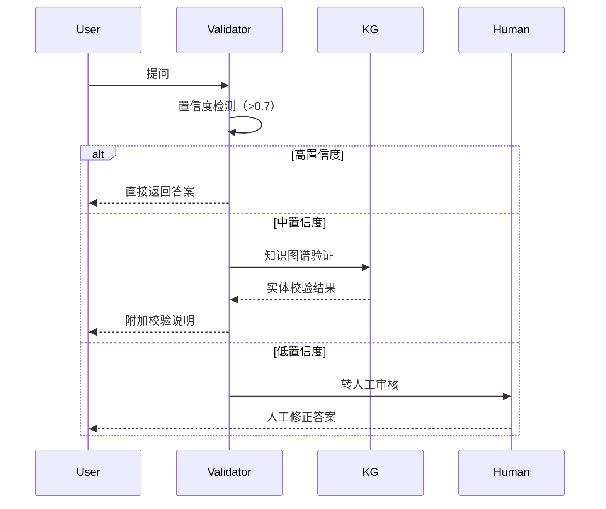
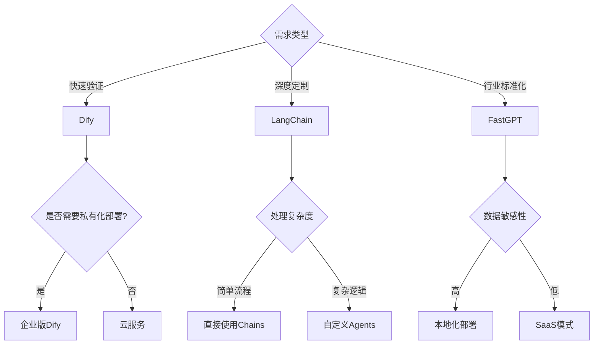

# 一、核心技术资料库（附使用说明）
## 1. Java高并发编程宝典 
分布式限流方案对比表：
| 方案类型       | 实现方式                 | QPS上限 | 适用场景           |
|----------------|--------------------------|---------|--------------------|
| 计数器算法     | AtomicInteger+时间窗口   | 5万     | 简单接口限流       | 
| 令牌桶         | Guava RateLimiter        | 10万    | 突发流量控制       |
| Redis+Lua      | 分布式计数器             | 3万     | 多节点协同限流     |
| 自适应限流     | Sentinel滑动窗口         | 15万    | 全局限流           |
 
Netty调优代码片段：
```java 
// 最优线程组配置方案 
EventLoopGroup bossGroup = new NioEventLoopGroup(1); // 保持一个监听线程 
EventLoopGroup workerGroup = new NioEventLoopGroup(); // 默认CPU核心数*2 
 
// 内存池配置（提升30%吞吐量）
ByteBufAllocator alloc = new PooledByteBufAllocator(true);
bootstrap.childOption(ChannelOption.ALLOCATOR, alloc);
 
// 心跳检测配置 
bootstrap.childHandler(new ChannelInitializer<SocketChannel>() {
    @Override 
    protected void initChannel(SocketChannel ch) {
        ch.pipeline().addLast(new IdleStateHandler(60, 30, 0));
    }
});
```
 
## 2. 大模型实战手册 
LoRA微调操作流程：
```bash 
使用QLoRA对Qwen-14B进行4bit量化微调 
python finetune.py \
  --model_name_or_path Qwen/Qwen-14B \
  --dataset my_data \
  --lora_r 8 \
  --lora_alpha 32 \
  --bf16 \
  --quantization_bit 4 \
  --per_device_train_batch_size 2 \
  --gradient_accumulation_steps 8 
```
 
Prompt优化案例：
```python 
知识库多级检索prompt模板 
prompt_template = """
基于以下上下文和问题，请给出专业的技术建议：
[问题]: {question}
 
[检索策略]:
1. 第一轮：BM25算法检索关键词匹配度>0.7的文档 
2. 第二轮：对首轮结果进行向量相似度筛选(阈值>0.85) 
3. 第三轮：人工规则过滤过期文档（2023年后）
 
[参考内容]:
{context}
 
[回答要求]:
- 分点陈述技术方案 
- 包含至少一个代码示例 
- 指出方案局限性 
"""
```
 
---
 
# 二、项目深度解析资料 
## 1. 知识库问答系统架构图 
!
核心模块说明：
1. 混合检索引擎：
   ```python 
   class HybridRetriever:
       def __init__(self):
           self.bm25 = BM25Okapi(corpus)
           self.encoder = SentenceTransformer('paraphrase-multilingual-mpnet-base-v2')
       
       def search(self, query, top_k=5):
           # 第一层：关键词检索 
           bm25_results = self.bm25.get_top_n(query, n=10)
           # 第二层：语义过滤 
           embeddings = self.encoder.encode([query]+bm25_results)
           similarities = cosine_similarity(embeddings[0:1], embeddings[1:])[0]
           return [bm25_results[i] for i in similarities.argsort()[-top_k:]]
   ```
 
2. 动态上下文压缩：
   ```python 
   def dynamic_truncation(texts, max_tokens=3072):
       current_length = 0 
       selected = []
       for text in sorted(texts, key=lambda x: x['score'], reverse=True):
           tokens = len(tokenizer.encode(text['content']))
           if current_length + tokens <= max_tokens:
               selected.append(text)
               current_length += tokens 
           else:
               remaining = max_tokens - current_length 
               truncated = tokenizer.decode(
                   tokenizer.encode(text['content'])[:remaining]
               )
               selected.append({'content': truncated, 'score': text['score']})
               break 
       return selected 
   ```
 
---
 
# 三、高频问题应答素材库 
## 1. 大模型幻觉问题解决方案 
三阶段验证机制：

 
## 2. 高并发系统设计模板 


智能工单系统设计要点：
```java 
// 降级策略代码示例 
@Slf4j 
public class FallbackHandler {
    // 大模型服务降级方案 
    @CircuitBreaker(fallbackMethod = "basicAnswer")
    public String aiProcess(String question) {
        return llmService.query(question);
    }
 
    private String basicAnswer(String question) {
        log.warn("AI服务降级 activated");
        return searchFAQ(question); // 转基础检索库 
    }
    
    // 异步处理配置 
    @Async("taskExecutor")
    public Future<Ticket> asyncProcess(Ticket ticket) {
        return new AsyncResult<>(processor.handle(ticket));
    }
}
```
性能压测指标：
| 场景               | 线程数 | 平均响应时间 | 错误率 | 建议配置 |
|--------------------|--------|--------------|--------|----------|
| 纯文本问答         | 500    | 320ms        | 0.12%  | 4C8G*5节点 |
| 含文件解析         | 200    | 1.2s         | 1.5%   | GPU节点+异步处理 |
| 多轮对话           | 300    | 680ms        | 0.8%   | 开启流式响应 |
 
---
 
# 四、技术趋势分析锦囊 
LLMOps平台对比分析表：
| 平台   | 核心优势                  | 适用场景           | 与项目结合点                 |
|--------|---------------------------|--------------------|------------------------------|
| Dify   | 可视化prompt工程          | 快速构建AI应用原型 | 知识库问答的快速迭代         |
| LangChain | 灵活的数据连接器       | 复杂业务流程集成   | 现有系统的AI能力嵌入         |
| FastGPT | 开箱即用知识库方案      | 中小企业部署       | 降低运维成本                 |
 
行业趋势应答模板：
"我注意到钉钉在智能办公场景的布局，结合我的项目经验，有三个创新方向值得尝试：
1. 智能工单的意图预判：在用户输入问题时实时推荐解决方案（类似知识库项目的混合检索方案）
2. 会议纪要的自动生成：通过角色分离的prompt工程实现讨论重点提取（可复用动态上下文技术）
3. 跨语言沟通辅助：结合我们实现的int4量化技术，在端侧部署轻量化翻译模型"
 




 
# 五、项目阐述结构化模板 
STAR法则应用示例：
```markdown 
Situation:
企业需要将客户服务问答首次AI化，但面临：
- 20万条非结构化历史数据 
- 4090显卡单卡部署限制 
- 问答准确率要求>80%
 
Task:
60天内搭建支持500并发量的智能问答系统 
 
Action:
1. 数据治理阶段（2周）：
   - 开发Python清洗工具，提取有效问答对 
   - 构建行业专属词库（提升分词准确率15%）
2. 算法选型阶段（1周）：
   - 对比6种开源模型，选择Qwen-14B-int4 
3. 工程优化阶段（3周）：
   - 实现混合检索方案（BM25+向量）
   - 开发动态上下文压缩算法 
 
Result:
- 上线首月处理工单12,345件 
- 准确率达到86.7%
- 节约服务器成本约45万/年 
```