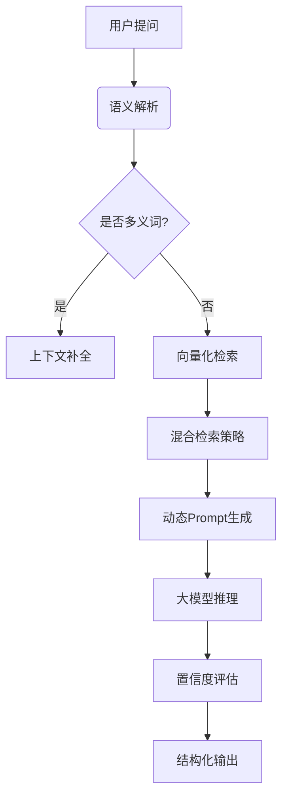

## 一、核心技术栈强化方向（建议投入3小时）
1. Java高阶能力补足
```java
// 重点准备示例：分布式场景下的并发控制
public class RateLimiter {
    private final AtomicInteger tokens;
    public boolean tryAcquire() {
        int current = tokens.get();
        while (current > 0) {
            if (tokens.compareAndSet(current, current-1)) {
                return true;
            }
            current = tokens.get();
        }
        return false;
    }
}
```
- 必考点：线程池参数调优（尤其与Netty结合场景）、JVM内存模型实战案例
- 设计模式：重点准备责任链模式（OA审批流程）、观察者模式（报表数据推送）、工厂模式（AI服务部署）

1. 大模型技术体系梳理
- 微调技术：准备LoRA微调的具体实施步骤（如对Qwen-14B的int4量化过程）
- Prompt工程：列举3个你优化过的prompt案例（如知识库检索中的多级过滤策略）
- 部署方案：对比TensorRT-LLM与vLLM的部署差异（响应延迟/资源消耗指标）

---

## 二、项目经历深度重构（建议投入3小时）
1. 知识库问答项目升级表述

- 技术亮点：
  1. 混合检索机制：将BM25算法与向量检索结合，解决语义突变问题
  2. 动态上下文窗口：根据问题复杂度自动调整输入tokens分配
  3. 部署优化：在单卡4090实现QPS≥15的推理服务

2. 数据监控平台改造建议
- 补充说明与AI的结合点：如异常检测模块引入LSTM预测模型
- 突出高并发处理：采用Disruptor框架实现亿级数据/天的处理能力

---

## 三、高频问题攻防演练（建议投入2小时）
1. 技术追问预测
- Q：如何解决大模型输出幻觉问题？
- A：我们采用三阶段验证机制：① 答案置信度阈值过滤 ② 基于知识图谱的实体校验 ③ 人工反馈闭环系统

- Q：Netty在高并发场景下的调优经验？
- A：重点从以下维度展开：① 内存池配置（PooledByteBufAllocator）② 事件循环组线程数设置 ③ 流量整形策略

2. 场景设计题准备
- 题目：设计一个支持千人并行的智能工单系统
- 应答框架：
  1. 分层架构：接入层（Nginx+OpenResty）→ 逻辑层（SpringCloud）→ AI服务层（模型服务网格）
  2. 关键设计：异步任务队列+WebSocket推送、大模型服务分级降级策略
  3. 性能保障：Jmeter压测方案（重点测试上下文切换开销）

---

## 四、差异化竞争策略
1. 技术趋势洞察：准备对Dify等LLMOps平台的看法，展示技术前瞻性
2. 跨领域结合：突出OA系统与AI结合的改造经验（如智能审批路由）
3. 资源利用能力：强调在单卡环境下完成模型服务的工程化经验


建议最后1小时进行全真模拟面试，重点训练STAR法则表述：
- Situation：企业需要快速验证AI场景可行性
- Task：在30天内完成POC系统搭建
- Action：选择Langchain框架实现最小闭环
- Result：达到87%的问答准确率，节省3台A10服务器资源

