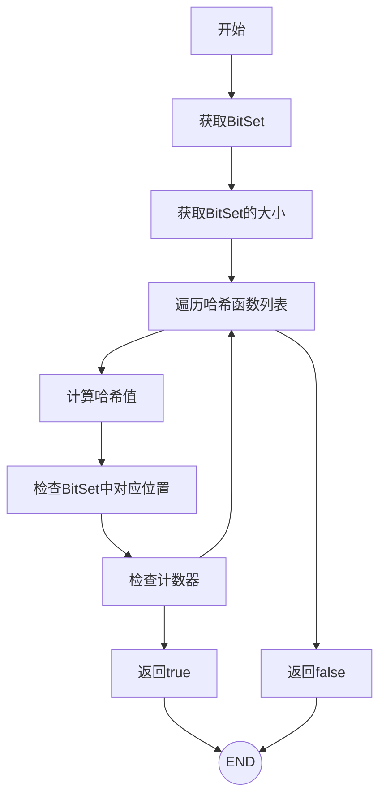
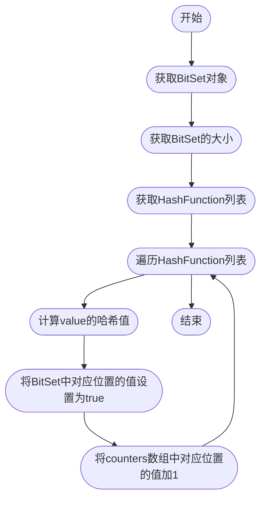
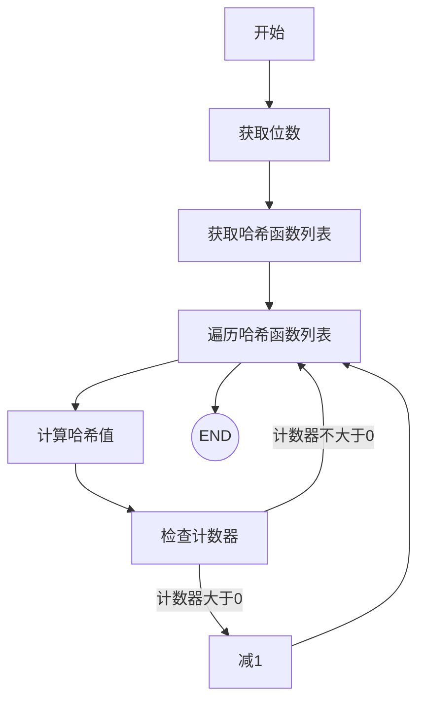
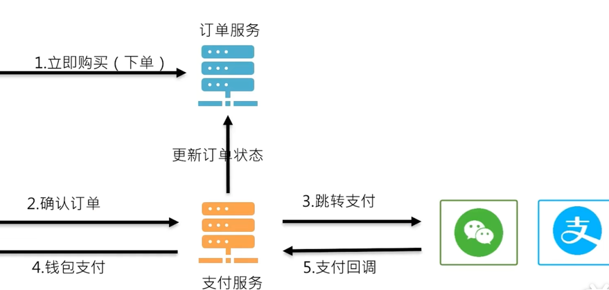

# redis 面试相关

## redis使用中常见的问题

### 缓存击穿
系统运行中某个key失效了，恰好此时这个key的并发量很高，让大量的请求直接打到了数据库
可能的原因：该key为热点数据，或者突然变为key
解决方案： 
1. 设置key点的key永不过期
2. 给redis查询加锁让请求排队，使用双重检查锁，避免大量阻塞

### 缓存雪崩
redis中的key在某个时刻集中失效了，使得高并发的请求量直接打到数据库
可能的原因：大量的key的过期时间相同； redis服务宕机
解决方案：
1. 为每个key设置过期时间时，加上随机的延时  —————— 针对情况一
2. 为redis做好集群、哨兵以及其他高可用举措（多机房、灾备等）

### 缓存穿透
用户请求到了redis中没有的数据，导致请求依然打到了数据库
可能的原因：请求不存在的id、名称等
解决方案：
1. 参数校验     通过校验剔除一些明显不可能存在的请求
2. 缓存对象   即使从数据库中未查询，依然缓存该key，值为空对象
3. 布隆过滤器   

#### 布隆过滤器

[代码位置](./MyBloomFliter/src/main/java/site/xzq_xu/bloom/BloomFilter.java)

##### 计数布隆过滤器
判断存在

添加元素

删除元素

## 场景题

### 给你一亿个Rediskeys统计双方的共同好友

解决思路：
使用set存储这些key，将用户id作为key，将他的好友作为value进行存储；
使用交集操作获取共同好友； -----   SINTERSTORE userid:new userid:20002 userid:20003
> 注意点： 一亿个数据不建议直接放在redis中， 可以使用 数据库分库分表、或者neo4j（图数据库）、HBase+Hadoop

### 如何防止重复下单

在用户步骤1下单时候，可能会存在多次点击、网络问题等导致的多次提交，需要防止重复生产订单

解决思路：
1. 前端按钮置灰（防君子不防小人）
2. 使用redis的setnx（setIfAbsent）执行，不存在则插入返回true，存在则返回false，来保证不会重复创建订单
   可以使用 用户token+商品URL+keyword（存在多种操作都需要不重复时，用recommit表示重复提交的keyword）作为key，防止重复提交
   注意给key设置过期时间。

